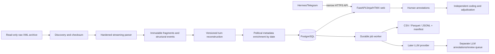
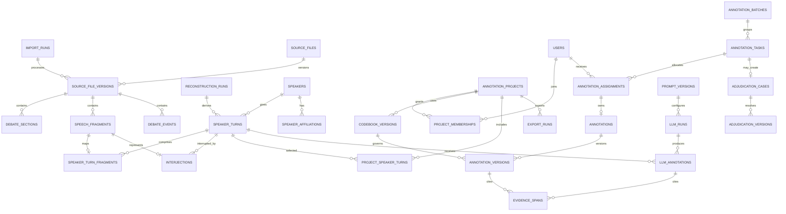

# Australian Hansard Annotation Platform — Implementation Plan

Status: Phases 0 through 3 completed by 24 July 2026. A bounded two-pass conference
prototype was added on 10 August 2026. Phase 4 remains unauthorised pending owner review
and research-method decisions. A private-pilot deployment package for
`annotator.polisde.tech` was prepared on 14 August 2026 but has not yet been executed on the
Hostinger VPS.

## 1. Executive summary

Build a modular monolith: a Python 3.12 preprocessing package and a FastAPI application sharing a PostgreSQL 16 database, with server-rendered Jinja2/HTMX pages as the primary annotation client. Run imports, exports, and later LLM work in separate worker processes that claim durable PostgreSQL jobs. Do not add Redis, a separate SPA, Supabase, or table partitioning in the first release.

The central design principle is provenance before convenience. Immutable source-file versions and speech fragments feed versioned speaker-turn reconstructions. Human coders receive independent assignments; their submitted labels are immutable revisions, never shared early or overwritten. Adjudication and LLM outputs are separate, attributable layers. An export manifest pins the source, pipeline, configuration, codebook, and label-selection rules needed to reproduce a dataset.

Phase 1 should be the preprocessing foundation, preceded by a short acceptance checkpoint on the decisions in section 33. It will stream XML, preserve every source event, reconstruct only high-confidence continuations, retain interjections separately, and emit reconciliation and anomaly reports before PostgreSQL or web work begins.

## 2. Repository findings

### Observed

- The repository root contains only `hansard_xml_files/`; it is not currently a Git repository and contains no application code, tests, configuration, README, container files, or metadata sources.
- `hansard_xml_files/` contains one directory for each year from 2010 through 2025. The assumed 2026 directory is not present.
- There are exactly 926 `.xml` files and no non-XML files below the archive.
- Total XML size is 784,583,349 bytes (about 748 MiB). Individual files range from 28,975 to 1,724,490 bytes.
- All 926 paths match `hansard_xml_files/YYYY/YYYY-MM-DD.xml`; the folder year agrees with the filename year.

| Year | Files | Bytes |
|---:|---:|---:|
| 2010 | 55 | 48,793,343 |
| 2011 | 64 | 60,404,350 |
| 2012 | 63 | 59,820,280 |
| 2013 | 48 | 42,815,601 |
| 2014 | 76 | 62,629,659 |
| 2015 | 75 | 61,936,329 |
| 2016 | 51 | 41,538,663 |
| 2017 | 64 | 55,272,338 |
| 2018 | 65 | 53,271,446 |
| 2019 | 45 | 36,429,681 |
| 2020 | 58 | 46,685,099 |
| 2021 | 67 | 52,275,875 |
| 2022 | 38 | 32,237,814 |
| 2023 | 65 | 55,151,961 |
| 2024 | 61 | 53,337,478 |
| 2025 | 31 | 21,983,432 |

### Consequences

- Phase 0 must initialise version control and repository conventions before code is added.
- Political affiliation data, codebooks, deployment details, and Hermes contracts are external dependencies, not repository assets.
- Raw XML must remain outside application migration and formatting workflows and should be mounted read-only in deployed import jobs.

## 3. Corpus and XML findings

### Audit method

A read-only stratified sample selected the first, middle, and last filename in every
available year: 48 files total. Eight files across 2010, 2016, 2020, and 2025 received
additional element/attribute inspection during planning. Phase 0 then ran a deterministic
streaming schema/count audit over all 926 files, including file SHA-256 and path/date
validation. This remains an audit rather than the Phase 1 production parser.

### Stable sampled properties

- All 48 sampled files parsed as XML and have a `<debates>` root.
- The document is predominantly a flat ordered stream of `<major-heading>`, `<minor-heading>`, `<speech>`, `<division>`, and `<bills>` elements.
- Sampled speech `talktype` values were `speech`, `continuation`, and `interjection`.
- Common speech attributes are `id`, `speakerid`, `speakername`, `talktype`, `time`, `approximate_wordcount`, `approximate_duration`, and `url`.
- Speech bodies contain multiple paragraphs and inline/block markup. Observed tags include `p`, `i`, `b`, `a`, `inline`, `ul`, `li`, `dl`, `dt`, `dd`, `table`, `tr`, `td`, and `sup`.
- No duplicate speech ID was found within or across the 48-file sample.
- The sample contained 12,944 speech fragments: 7,658 `speech`, 1,719 `continuation`, and 3,567 `interjection`.
- The complete Phase 0 audit found 269,793 speech fragments: 156,123 `speech`, 38,925
  `continuation`, and 74,745 `interjection`. All 926 XML files parsed; no duplicate
  non-empty speech source IDs or path/date errors were found.

### Observed drift and inconsistencies

- In the 2010 sample, 79 of 1,062 speech elements used `nospeaker` and lacked `speakerid`/`speakername`. The sampled frequency fell to eight in 2011, one in 2012, and zero from 2013 onward. Later files omit `nospeaker` rather than setting it false.
- Most 2010 times use `HH:MM:SS`; later years mostly use `HH:MM`. `unknown`, empty strings, truncated values such as `15:`, values with trailing punctuation, and strings containing role/electorate text were observed. Time must be parsed as optional data with raw preservation.
- Early files contain a wider range of embedded lists, definition lists, tables, links, bold text, and superscripts; later samples mainly use paragraphs, italic content, and unordered lists. Cleaning cannot assume `<p>` and `<i>` only.
- Collective interruptions can be encoded as `talktype="speech"`, for example `speakerid="unknown"` with `speakername="Honourable Members"` and text such as “Honourable members interjecting—”. A literal “every `speech` starts a turn” rule would break valid continuation chains.
- Some continuations have no safe parent. One sampled sequence begins with a member's question, collective “speech” interruptions, a presiding-officer interjection, then the Prime Minister's answer marked `continuation`; there is no preceding Prime Minister fragment to merge.
- `<division>` is not a speech and has vote counts/member lists. `<bills>` is also a top-level event containing one or more bill IDs, URLs, and titles. Both require preservation even though annotation eligibility differs.
- Empty minor headings occur and are meaningful as “no supplied subheading,” not parser failure.

### Scale baseline

The exact Phase 0 structural baseline is 269,793 fragments, including 74,745
interjections and 38,925 continuations. There are 156,123 `talktype="speech"` fragments,
but this is not an exact speaker-turn count because the source also labels some
collective interruptions as `speech`, while some orphan continuations may become
standalone derived turns. Plan capacity for approximately 155,000–170,000 reconstructed
turns. Phase 1 must produce and reconcile the exact semantic count without changing the
269,793-fragment source baseline.

## 4. Assumptions

- The archive represents federal House of Representatives debates (`hansardr` appears in sampled source URLs), but chamber will be a configured and validated field rather than inferred from a directory name alone.
- The raw archive is authoritative and immutable; corrected upstream files arrive as new content at the same logical path and therefore create a new `source_file_version`.
- A speaker turn, not an XML fragment, is the unit normally assigned for annotation.
- Project-specific eligibility and sampling rules are versioned; no global destructive exclusion is applied.
- Initial scale is one VPS, a small user group, and hundreds of thousands—not tens of millions—of records.
- Existing Hermes and reverse-proxy details are unknown and must be inventoried before deployment work.
- CAP and Australian taxonomy definitions will be supplied or approved by the research owner.

## 5. Blocking questions

These do not block planning, but the starred items block the indicated implementation phase.

1. **Before Phase 1:** Is the archive exclusively House of Representatives Hansard, and what provenance/licence statement and canonical archive location should be recorded?
2. **Before Phase 1:** Should an explicitly collective `talktype="speech"` interruption be allowed between a turn and its continuation under the conservative rule proposed in section 11?
3. **Before Phase 3:** What are the authoritative CAP version, Australian analytical domains, issue taxonomy, and first policy-annotation codebook?
4. **Before Phase 3:** Who are the initial users, and may project managers also annotate/adjudicate in projects they manage?
5. **Before Phase 4:** How many independent coders are required per item, what constitutes disagreement, and who can unblind/recode?
6. **Before Phase 5:** What source will provide date-valid party, electorate, ministry, and government/opposition metadata, and how should identity ambiguities be adjudicated?
7. **Before Phase 7:** Which LLM providers/models, data-retention terms, budget controls, and human-review thresholds are acceptable?
8. **Before deployment:** What OS/resources, domain/subdomain, current proxy, Docker networks, backup destination, and Hermes integration mechanism exist on the Hostinger VPS?

## 6. Recommended architecture

Use one repository and one deployable application image with separately invoked roles:

- `web`: FastAPI, Jinja2, HTMX, authentication, API, admin UI.
- `worker`: the same codebase running durable PostgreSQL jobs for imports/exports and later LLM batches.
- `postgres`: the transactional and audit source of truth.
- `proxy`: reuse the VPS's existing HTTPS proxy; use Caddy if none exists.
- `hermes`: remains independently deployed and calls a narrow application API.

Keep domain modules (`corpus`, `annotations`, `adjudication`, `exports`, `integrations`) behind service functions and transaction boundaries. This provides modularity without cross-service consistency problems. Raw XML is read-only input; generated Parquet and export artefacts live in controlled object/file storage with database manifests.

## 7. Alternatives considered

- **React/Next.js SPA:** richer client state, but adds a second build/deployment/auth surface and duplicates validation. HTMX plus small JavaScript modules is sufficient for forms, autosave, task claiming, and side-by-side adjudication. Reconsider only after measured UX limitations.
- **Supabase:** managed auth/realtime can help a public app, but provides little benefit on an existing VPS and complicates local reproducibility and access control. Plain PostgreSQL is preferable.
- **Microservices:** import, annotation, and LLM services could be separated later. Initially they would add queues, networking, distributed tracing, and version skew without scale evidence.
- **Redis queue from day one:** unnecessary while PostgreSQL can durably claim low-volume work with `SKIP LOCKED`. Add a broker only when LLM throughput, scheduling, or retry telemetry demonstrates need.
- **Destructive preprocessing to a single clean table:** simpler, but loses fragment lineage, anomaly evidence, and reproducibility; rejected.
- **Telegram-first workflow:** convenient but inadequate for long-text review and adjudication; rejected as the primary interface.

## 8. Recommended technology stack

| Area | Recommendation |
|---|---|
| Runtime | Python 3.12 |
| XML | `lxml` streaming parser with DTD/entity/network disabled, strict mode, explicit DOCTYPE rejection |
| Data processing | Typed Python domain models; PyArrow for validation/Parquet outputs |
| Web/API | FastAPI, Starlette, Pydantic v2, Jinja2, HTMX, small ES modules |
| Database | PostgreSQL 16, SQLAlchemy 2, Alembic, psycopg 3 |
| Auth | Local username/password, Argon2id, opaque server-side sessions in PostgreSQL |
| Jobs | PostgreSQL durable job table plus dedicated worker process |
| Quality | pytest, pytest-postgresql/test container, HTTPX, Playwright, Ruff, mypy, pre-commit |
| Logging/metrics | Structured JSON logs, request/run correlation IDs, Prometheus-compatible metrics |
| Deployment | Docker Compose behind the existing proxy; Caddy if there is no incumbent |
| Backup | `pg_dump` plus encrypted off-host copies and periodic restore drills |

Pin dependencies with a lockfile and record image digests in release manifests.

## 9. Data-flow diagram



## 10. Proposed repository structure

```text
.
├── docs/
├── hansard_xml_files/             # immutable; excluded from formatting/migrations
├── src/hansard_annotator/
│   ├── app/                       # FastAPI assembly, middleware
│   ├── auth/
│   ├── corpus/                    # discovery, parsing, reconstruction
│   ├── metadata/
│   ├── projects/
│   ├── annotations/
│   ├── adjudication/
│   ├── exports/
│   ├── jobs/
│   ├── integrations/
│   ├── templates/
│   └── static/
├── config/
│   ├── business_types/
│   ├── structural_rules/
│   └── taxonomies/
├── migrations/
├── tests/
│   ├── fixtures/xml/
│   ├── unit/
│   ├── integration/
│   └── browser/
├── scripts/                       # thin, documented operational entry points
├── pyproject.toml
├── compose.yaml
└── .env.example
```

Do not copy or rewrite raw XML into the package. Test fixtures must be small synthetic or explicitly approved excerpts.

## 11. Preprocessing algorithm

### 11.1 Discovery and runs

1. Create an `import_run` with pipeline Git commit/image digest, Python/dependency versions, parser version, configuration hashes, host, start time, and parameters.
2. Recursively enumerate only `hansard_xml_files/{year}/*.xml` without following symlinks. Sort by relative POSIX path for deterministic processing.
3. Validate the folder and filename with a strict date parser. Record malformed paths and date/year disagreement; do not abort unrelated files.
4. Stream SHA-256 from bytes, capture byte size and modification time, and upsert logical `source_files(relative_path)`.
5. If an already-successful `source_file_version` has the same SHA-256, parser/pipeline version, and relevant configuration hash, record `unchanged_skipped`. A changed hash creates a new immutable version; it never overwrites the old one.
6. Process files in bounded batches and commit per file (or a small configurable batch). One failure rolls back that file only.

### 11.2 Safe parsing

- Use `lxml.etree.iterparse` to avoid loading the corpus into memory. Reject a `DOCTYPE` during preflight; configure `resolve_entities=False`, `load_dtd=False`, `no_network=True`, `recover=False`, and `huge_tree=False`.
- Limit input path to the configured archive root and enforce file-size/element/text-size ceilings that are generous relative to observed maxima. Treat XML text as untrusted.
- Clear processed elements and preceding siblings to bound memory.
- Preserve raw attribute strings. Parse typed derivatives separately and attach field-level warnings rather than coercing silently.
- Catch syntax, encoding, validation, and resource-limit errors. Store a sanitised error code/message and continue with the next file.

### 11.3 Document-order state

Maintain `sequence_number`, `current_major_section`, and `current_minor_section` while consuming direct children of `<debates>`.

- A major heading creates a section, becomes current, and clears the current minor heading.
- A minor heading creates a child section and becomes current; empty text remains an explicit empty original value.
- Every speech, division, and bills event receives the current section IDs and its global document sequence.
- Unknown top-level tags become preserved `debate_events(event_type="unknown")` plus a warning. They are never dropped.

### 11.4 Fragment preservation

Create one immutable `speech_fragments` row per `<speech>` even when fields or text are malformed. Required representation includes:

`source_file_version_id`, source `fragment_id`, deterministic sequence, inferred filename date, configured/validated chamber, original major/minor heading, original attributes, raw speaker fields, `talktype_raw`, raw time/count/duration/URL/`nospeaker`, `text_raw`, `text_clean`, paragraph/block representation, calculated word count, parse status, warning codes, optional projection checksum, and timestamps.

The immutable source-file checksum anchors the exact original bytes. Source file version,
fragment source ID, and sequence locate the fragment; original attributes and extracted
text preserve the relevant parser projection. Full canonical fragment XML is not stored
in PostgreSQL by default. It may be retained for a bounded anomaly/debugging case, or as
a hashed external artefact, only when testing demonstrates a concrete need. A unique
constraint on `(source_file_version_id, sequence_number)` guarantees reconciliation.
Source IDs are data, not primary keys, because they may be absent or duplicated.

Preserve `<division>` and `<bills>` through `debate_events`, with normalised child rows if later analysis needs votes/bill identities. They can drive flags but are not forced into `speech_fragments`.

### 11.5 Conservative text cleaning

1. Decode XML character/entity references through the hardened parser.
2. Collect all descendant text in document order, including meaningful inline formatting content.
3. Preserve paragraph/list/table boundaries in a paragraph/block representation; join blocks with `\n\n`.
4. Normalise Unicode to NFC and convert CRLF/tabs/repeated intra-line whitespace conservatively. Trim boundary whitespace.
5. Preserve punctuation, quotations, case, hyphens/dashes, and quoted/reported language. Never lowercase, stem, remove stopwords, or substitute typographic punctuation for LLM input.
6. Store both raw extracted text and clean text. Recalculate Unicode-aware word count and retain the source estimate for comparison.
7. Escape all text on HTML output; never render source markup as trusted HTML.

### 11.6 Turn reconstruction

Reconstruction is a deterministic, versioned derivation, not an update to fragments.

1. Process fragments in file sequence within an unchanged heading scope.
2. A normal `talktype="speech"` with a known individual begins a new candidate turn.
3. A `talktype="interjection"` never enters candidate text. Link it to the active candidate when one exists and keep the candidate open.
4. A tightly defined *collective interruption-like speech* may also leave the candidate open only when all configured conditions hold: unknown/absent speaker ID, name in a reviewed collective-speaker list, and text matches an explicit interruption marker such as “members interjecting” or an approved short collective response. It remains a separate fragment/interjection-like event. Every application of this exception records a reason code.
5. For a continuation, merge only when:
   - an active candidate exists in the same file and same major/minor section IDs;
   - no division, bills/unknown structural event, or different substantive individual speech intervened;
   - non-unknown speaker IDs exactly match; or, only if an ID is absent/unknown on one side, normalised full speaker names exactly match and the name is neither collective nor ambiguous;
   - neither fragment has a blocking parse/duplicate-identity warning.
6. Append continuation blocks with a paragraph boundary; add an ordered row to `speaker_turn_fragments` with relation `continuation`. Do not add intervening text.
7. On ID conflict, ambiguous name, heading boundary, structural boundary, missing candidate, or duplicate ID ambiguity, do not guess. Emit a standalone orphan-continuation turn (or non-eligible derived record) and a `continuation_anomaly` reason.
8. A different substantive individual speech closes the previous candidate. A heading change always closes it.

Important implication from the audit: some source answers start as `continuation` without a matching earlier fragment. Preserving these as explicit orphan continuations is safer than attributing them to the preceding questioner.

### 11.7 Interjections and flags

An `interjections` row points to its source fragment and optionally to the interrupted turn. It retains sequence, identity, collective/individual classification, raw/clean text, and link confidence/reason. A join table is preferable if later evidence shows one collective event interrupts several turns; initially enforce one source fragment per interjection and one nullable primary interrupted turn.

Versioned structural rules compute, but never destructively filter:

`is_presiding_officer`, `is_collective_speaker`, `is_procedural`, `is_ceremonial`, `is_division`, `is_question_time`, `is_question`, `is_answer`, `is_interjection`, `is_continuation_merged`, `interrupted`, `interruption_count`, `has_known_speaker`, `metadata_complete`, `eligible_50_words`, `eligible_100_words`, and `eligible_main_analysis`.

Every flag stores or can resolve its rule/configuration version. Eligibility is project-specific when criteria differ.

### 11.8 Business mapping and reconciliation

- Retain heading originals and normalised comparison keys.
- Map headings through a reviewed YAML configuration with semantic version and checksum. Exact/anchored rules are ordered and tested.
- Unknown or conflicting headings receive `business_type=NULL`, `mapping_status=unknown/conflict`, and appear in review output. No fuzzy guess is silently accepted.
- Reconcile per file: discovered speech count equals inserted fragment count; every fragment is exactly one of initial-turn, merged-continuation, interjection, or orphan/anomaly; source order and IDs remain traceable.
- Emit `file_processing_report.csv`, `unknown_headings.csv`, `malformed_files.csv`, `missing_speakers.csv`, `missing_party_metadata.csv`, `continuation_anomalies.csv`, `duplicate_ids.csv`, `corpus_summary.csv`, and `run_manifest.json`. Reports include schemas and hashes.

## 12. Data model

All tables have `created_at`; mutable tables also have `updated_at` and optimistic `row_version` where users can edit state. High-volume internal rows use `bigint GENERATED ALWAYS AS IDENTITY`. Externally addressed project/task/annotation/job records also have a random UUID `public_id`. Source-derived IDs are never database primary keys.

### Corpus and provenance

| Table | Purpose and important fields | Keys, constraints, indexes | Mutability |
|---|---|---|---|
| `import_runs` | Run manifest, versions/hashes, parameters, status, counts, error summary | bigint PK; status/time checks; indexes status/start | Append-only after finalisation |
| `source_files` | Logical relative archive path, current version pointer | bigint PK; unique relative path; FK current version (deferred); path safety check | Mutable pointer only |
| `source_file_versions` | SHA-256, size, mtime evidence, date, chamber, import run, parse outcome | bigint PK; FK source/run; unique `(source_file_id, sha256, pipeline_version, config_hash)`; hash/date indexes | Append-only |
| `debate_sections` | Ordered major/minor original and normalised headings | bigint PK; FK file version/parent; unique `(file_version, sequence)`; level check; heading indexes | Immutable |
| `debate_events` | Divisions, bills, and unknown non-speech top-level events | bigint PK; FK file version/section; unique `(file_version, sequence)`; JSON schema/type checks | Immutable |
| `speech_fragments` | Every source speech and raw/clean fields | bigint PK; FKs file version/sections/speaker candidate; unique `(file_version, sequence)`; partial unique source fragment ID when non-null; talktype/date/word/speaker indexes | Immutable |
| `reconstruction_runs` | Pipeline/rule version for a derived turn set | bigint PK; FK import run; unique version/hash tuple | Append-only |
| `speaker_turns` | Derived annotation unit, assembled text, counts, flags, orphan status | bigint PK + UUID; FKs reconstruction/file/section/speaker; unique `(reconstruction_run, file_version, turn_sequence)`; GIN FTS plus date/speaker/business/eligibility indexes | Immutable per reconstruction |
| `speaker_turn_fragments` | Ordered lineage from turn to fragments | composite PK `(turn_id, ordinal)`; FKs; unique `(reconstruction_run, fragment_id)` for non-interjection assignment; relation check; index fragment | Immutable |
| `interjections` | Separate interruption record and optional interrupted turn | bigint PK; unique fragment FK; nullable turn FK; individual/collective and confidence checks; turn/sequence indexes | Immutable |
| `speakers` | Canonical person/collective identities and aliases | bigint PK + UUID; unique canonical external ID when known; alias/name indexes | Curated, audited |
| `speaker_affiliations` | Date-valid party, coalition, status, electorate, ministerial/parliamentary/presiding roles and source | bigint PK; FK speaker; `daterange`/valid dates; no overlapping records for the same dimension/source via exclusion constraint; GiST date index | Versioned/append corrections |

Date enrichment joins `speaker_turns.speaker_id = speaker_affiliations.speaker_id` and `speech_date <@ valid_daterange`. Multiple dimensions may have independent date ranges; ambiguous or overlapping authoritative claims create a quality issue rather than an arbitrary selection.

### Users, projects, and work allocation

| Table | Purpose and important fields | Keys, constraints, indexes | Mutability |
|---|---|---|---|
| `users` | Username, password hash, global role, active/locked state | bigint PK + UUID; unique case-insensitive username; role check; no plaintext password | Mutable, audited |
| `user_sessions` | Hashed opaque token, user, expiry, CSRF secret, last seen | UUID PK; FK user; expiry/revocation indexes; token unique | Mutable/revocable |
| `annotation_projects` | Name, description, workflow settings, visibility/blinding, active codebook | bigint PK + UUID; unique slug; state and coder-count checks | Mutable, audited |
| `project_memberships` | Project-scoped role and permissions | composite PK `(project,user)`; FKs; role check | Mutable, audited |
| `codebook_versions` | Immutable version, definitions/examples/rules, published hash | bigint PK + UUID; project/taxonomy FK; unique `(project, version)` and content hash | Append-only once published |
| `project_speaker_turns` | A turn's inclusion, sampling stratum, eligibility snapshot | composite PK `(project,turn)`; FKs; indexes project/status/strata | Append-only for a frozen batch |
| `annotation_batches` | Named/versioned selection criteria and random seed | bigint PK + UUID; FK project; filter JSON, snapshot hash | Append-only once frozen |
| `annotation_tasks` | Project-turn unit, required coder count, state/priority | bigint PK + UUID; FKs project/turn/batch; unique `(project,turn,batch)`; state/count checks; queue index | Mutable state, audited |
| `annotation_assignments` | One coder's blind unit, claim lease, status, ordering | bigint PK + UUID; FKs task/user; unique `(task,user)`; status/lease checks; partial queue index | Mutable state, audited |
| `saved_filters` | User/project-scoped validated filter definition | bigint PK + UUID; FKs; unique `(owner,project,name)` | Mutable, audited |

Task claiming operates on assignments. Preassignment can enforce balanced overlap; unassigned pool rows can atomically acquire a coder while respecting project membership and required-coder limits.

### Labels, adjudication, LLM, and outputs

| Table | Purpose and important fields | Keys, constraints, indexes | Mutability |
|---|---|---|---|
| `annotations` | Stable human annotation series for one assignment; status/current version | bigint PK + UUID; FKs assignment/user/codebook; unique assignment; submitted-state checks | Mutable pointer/status only |
| `annotation_versions` | Full policy/hostility payload, notes, uncertainty, interface source, supersedes, reason | bigint PK + UUID; FKs annotation/codebook/author/prior; unique `(annotation, revision_no)`; score/conditional checks; indexes labels/uncertainty | Append-only |
| `annotation_secondary_domains` | Multiple taxonomy-coded secondary domains | composite PK `(annotation_version, domain_code)`; FK taxonomy | Append-only with version |
| `evidence_spans` | Character offsets/quoted hash/type for hostility or topic evidence | bigint PK; FK human version or LLM annotation (exactly one); bounds/type checks | Append-only |
| `adjudication_cases` | Disagreement state and eligible source annotations | bigint PK + UUID; FK task/project; unique active case/task; state checks | Mutable state, audited |
| `adjudication_versions` | Final label choice/custom values, source version references, notes/actions | bigint PK + UUID; FK case/adjudicator/codebook/prior; revision unique | Append-only |
| `prompt_versions` | Immutable prompt/template/schema/codebook binding and few-shot IDs | bigint PK + UUID; unique provider/name/version/content hash | Append-only |
| `llm_runs` | Batch/job, provider/model/version, prompt/codebook, parameters, budget/status/counts | bigint PK + UUID; FKs; status/cost/token checks; indexes status | Append-only after finalisation |
| `llm_annotations` | Turn/run, input hash, raw response, parsed JSON, validation, tokens/cost/latency/review reason | bigint PK + UUID; FKs run/turn; unique `(run,turn,input_hash)`; validation/review indexes | Append-only |
| `jobs` | Durable import/export/LLM work with attempts, lease, heartbeat, idempotency key | bigint PK + UUID; unique job type/idempotency key; state/attempt checks; claim index | Mutable state; events audited |
| `export_runs` | Requester, project, frozen filters, label-source policy, format, artefact hash/path, manifest | bigint PK + UUID; FKs; status/hash indexes | Append-only after finalisation |
| `audit_events` | Actor, action, target, request/interface, before/after metadata, correlation ID | bigint PK; actor FK nullable; event/time/target indexes | Append-only |

Core policy and hostility fields should be typed columns/FKs for validation and analysis; provider-specific/raw payloads may use JSONB. Conditional checks include: hostility score/target/evidence are required only when `attack_present=true`; adjudicated values cite source versions or a custom rationale; submitted versions cannot be edited. Database triggers or restricted grants prevent update/delete on append-only tables.

## 13. Mermaid ER diagram



## 14. Database constraints and indexes

- Use foreign keys everywhere, UTC `timestamptz`, strict enums/checks, and `NOT NULL` unless absence has defined meaning.
- Prevent overlapping affiliation claims with PostgreSQL range exclusion constraints scoped by speaker, dimension, and source priority. Use `[valid_from, valid_to)` semantics.
- Enforce independent coding with unique `(task_id, user_id)` assignments and service/database rules preventing a coder from reading other submitted versions until unblinding criteria are met.
- Claim with one transaction: select an eligible assignment `FOR UPDATE SKIP LOCKED`, set `claimed_by`, lease expiry, and status, then commit. A partial B-tree index covers queued rows ordered by priority/created time.
- Add B-tree indexes for date, speaker, project/task state, codebook, business type, party-on-date materialisation, and annotation status. Use trigram indexes only after search requirements are confirmed.
- Add a generated/stored `tsvector` or maintained FTS column on turn clean text with a GIN index if full-text search enters Phase 3 acceptance; do not index raw fragment XML.
- Use keyset pagination `(speech_date, id)` or `(priority, id)`, not deep offsets.
- Use `speaker_turn_fragments` rather than an ID array: it enforces referential integrity, preserves order/relation, supports anomaly queries, and survives ID representation changes.
- Do not partition initially. Roughly 250,000 fragments is small for PostgreSQL; revisit at several million rows or demonstrated maintenance/query pain. Logical year columns and indexes are sufficient.

## 15. Authentication and roles

Initial username/password authentication is sufficient. Hash passwords with Argon2id using current calibrated parameters; support forced rotation/reset without routine expiry. Store only a hashed opaque session token server-side. Cookies are `Secure`, `HttpOnly`, `SameSite=Lax`, narrowly scoped, rotated at login/privilege change, and expire by idle and absolute timeout. State-changing browser requests require CSRF tokens.

| Role | Permissions |
|---|---|
| `admin` | Manage users/system settings/imports; view audit and operational data; no automatic right to alter submitted labels |
| `project_manager` | Create/manage assigned projects, membership, codebooks, batches, assignments, approved exports and unblinding |
| `annotator` | View assigned project material; claim/submit/revise own allowed work; never see peers early |
| `adjudicator` | View completed source annotations only for assigned cases; adjudicate/return for recoding |
| `viewer` | Read approved project summaries/codebooks/exports; no unpublished labels unless explicitly granted |

Global role is a ceiling; `project_memberships` grants project-local access. Deny by default in both HTML and API service layers. New collaborators require an admin-created account, project membership, temporary reset flow, and audit entry. Do not expose database credentials or use browser-direct database access.

## 16. Annotation workflow

1. Manager freezes a codebook version and a reproducible batch selection.
2. The system creates a task per project-turn and balanced assignments per coder.
3. A coder claims an assignment atomically; a lease prevents abandoned claims from blocking the queue.
4. Workspace loads speech and permitted context, with affiliation resolved on speech date. Context never exposes another coder's label.
5. Local draft state is restored, validated, and periodically saved as a server draft. Drafts are private and not research labels.
6. Submit creates an immutable annotation version and completes that assignment in one transaction. `Save and next` then claims/opens the next item.
7. Revisions append a new version with reason; the old version remains queryable.
8. Skip releases/requeues according to project policy and stores a reason. Flag retains the assignment and creates a review marker.
9. When the required number of assignments finish, a comparison service creates no case for agreement or an adjudication case for configured disagreement.

Policy controls include CAP major/subtopic, Australian domain/issue, multiple secondary domains, uncertainty, and notes. Hostility projects additionally expose attack, score, typed target, out-party direction, evidence spans, quoted/reported-language and uncertainty fields. Project schema controls which are required.

## 17. Independent coding and adjudication

- Blindness is server-enforced, not merely hidden in HTML. Annotation list endpoints filter versions by actor/project state.
- Managers see progress counts by default, not answers. Unblinding is a distinct audited state/action.
- Agreement rules are versioned per project and can compare all typed fields or a declared subset.
- An adjudicator sees coder A/B in randomised or pseudonymous order after all required submissions, plus codebook version differences if any.
- Actions are: adopt a cited source version, enter a new adjudicated payload, record a codebook issue, or return specific assignments for recoding.
- An adjudication version never deletes disagreement. Re-adjudication appends another version and requires a reason.
- “Gold” is an export selection policy over a pinned adjudication version, not a mutable column on a speech.

## 18. Web dashboard pages

- **Login:** accessible username/password form, generic failures, rate limiting, password-reset/admin contact guidance.
- **Home:** project cards, own queued/claimed/completed/flagged counts, progress, and only authorised agreement summaries.
- **Task queue:** validated filters for year/parliament/speaker/party/status/business/headings/words/policy/uncertainty/disagreement; saved filters and frozen-batch creation for managers.
- **Annotation workspace:** metadata header; readable speech; source link; interruption summary; collapsible preceding/following context; codebook drawer; typed controls; private draft indicator; save, save-next, skip, flag, back; conflict-safe revision.
- **Adjudication:** side-by-side completed versions, evidence highlighting, difference summary, adopt/custom/recode/codebook-issue controls.
- **Codebook:** immutable published versions, definitions, inclusion/exclusion rules, positive/negative/borderline examples, and change notes.
- **Admin/import:** run state, file failures, unknown headings, missing metadata, duplicate IDs, anomalies, corpus summary, and narrowly scoped reprocess action with preview.
- **Export:** filter builder, source-of-label policy, format, estimated size, status, manifest, checksum, and authorised download.
- **LLM review (later):** prediction beside text, evidence/model/prompt/confidence/reason, approve/correct/escalate; human correction creates a human review version, not an LLM overwrite.

Use semantic HTML, visible focus, labelled controls, skip links, correct heading hierarchy, and WCAG 2.2 AA contrast/interaction targets.

## 19. Mobile UX

- Single-column reading flow, 16px-or-larger body text, comfortable line length, wrapping metadata chips, and no ordinary horizontal scroll.
- Sticky bottom action bar that respects safe-area insets and never covers the final text/form field; secondary actions move into an accessible menu.
- Minimum 44×44 CSS-pixel touch targets and native controls where possible.
- Long text renders server-side in paragraphs; context/interjections are collapsed by default. Avoid injecting the entire queue into the page.
- Drafts save after a short debounce and on meaningful field change to a private server record using an idempotency key. `sessionStorage` may hold an encrypted/non-sensitive recovery hint, but server draft is authoritative.
- Refresh restores the draft and warns if the assignment lease expired. Optimistic concurrency prevents an old tab overwriting a newer revision.
- Keyboard shortcuts are discoverable and disabled while typing; every shortcut has a visible-button equivalent.

## 20. API design

HTML routes and `/api/v1` call the same services. Return RFC 9457 problem details with correlation IDs. Cursor-list responses use `{items, next_cursor}`. State-changing calls accept `Idempotency-Key`; stale writes use `If-Match`/row version.

| Endpoint | Auth/authorisation | Request → response | Errors, idempotency, transaction |
|---|---|---|---|
| `POST /auth/login` | Public, rate limited | credentials + CSRF bootstrap → user/session | generic 401/429; rotates session atomically |
| `POST /auth/logout` | Session owner | CSRF → 204 | idempotent revocation |
| `GET /auth/me` | Authenticated | — → user and project capabilities | 401 |
| `GET /api/v1/speeches` | Project member; only included turns | validated filters/cursor → summary page | 400/403; read-only snapshot |
| `GET /api/v1/speeches/{id}` | Member with turn visibility | — → text, metadata, flags, permitted interruptions | 403/404 |
| `GET /api/v1/speeches/{id}/context` | Same | bounded before/after count → summaries | cap count; 400/403 |
| `POST /api/v1/projects/{id}/assignments/claim` | Annotator membership | optional filters → assignment/task/lease | 409 none/already current; idempotent key; one `SKIP LOCKED` transaction |
| `GET /api/v1/projects/{id}/assignments/current` | Owner | — → active assignment/draft | 404 |
| `POST /api/v1/assignments/{id}/skip` | Owner | reason/version → state | 409 stale; transaction releases/requeues and audits |
| `POST /api/v1/assignments/{id}/flag` | Owner | reason → flag | idempotent by key |
| `POST /api/v1/assignments/{id}/release` | Owner/manager | row version/reason → state | cannot release submitted; transactional |
| `PUT /api/v1/assignments/{id}/draft` | Owner | typed partial payload/version → draft/version | idempotent; 409 stale |
| `POST /api/v1/assignments/{id}/annotations` | Owner, valid lease/codebook | complete typed payload + evidence → immutable version | 422/409; exactly-once by idempotency key; annotation, assignment, audit in one transaction |
| `GET /api/v1/speeches/{id}/annotations` | Visibility policy permits | source/status filters → permitted versions | 403 while blinded |
| `POST /api/v1/annotations/{id}/revisions` | Author or authorised manager under policy | full replacement + reason → new version | append-only, 409 stale |
| `GET /api/v1/adjudication/cases/next` | Assigned adjudicator | project → case and versions | `SKIP LOCKED` claim; 404 none |
| `POST /api/v1/adjudication/cases/{id}/versions` | Case adjudicator | adopt/custom/recode payload → version/state | 422/409; one transaction |
| `GET /api/v1/codebooks` | Project member | project → published metadata | no drafts without manager permission |
| `GET /api/v1/codebooks/{id}` | Project member | — → immutable definitions/hash | 404/403 |
| `POST /api/v1/import-runs` | Admin | scoped paths/config/dry-run → job/run | idempotent; never accepts arbitrary paths |
| `GET /api/v1/import-runs/{id}` | Admin/manager with permission | — → state/counts/report links | 403/404 |
| `POST /api/v1/export-runs` | Manager/authorised viewer | project/filter/label policy/format → export job | freeze request in transaction; async |
| `GET /api/v1/export-runs/{id}` | Requester/authorised member | — → status/manifest/download metadata | signed short-lived download |

Imports and exports remain asynchronous even if a small request finishes quickly, giving one consistent audited contract.

## 21. Telegram/Hermes integration

Postpone Telegram until the web workflow and methodology are stable. Then expose application-service operations through `/api/v1/integrations/hermes/...`: next task, get task, submit, skip, flag, undo latest allowed revision, and progress.

- Hermes authenticates with a rotatable service credential scoped to these endpoints, preferably mTLS or a hashed bearer token restricted at the proxy.
- Each Telegram numeric user ID maps to exactly one active application user in an allowlist table. Service identity never substitutes for user identity.
- The backend rechecks project membership, blinding, assignment ownership, codebook, and validation on every call.
- No database credential, SQL surface, shell/tool access, or arbitrary speech lookup is exposed.
- Submission uses the same annotation service/transaction and records `interface_source="telegram"`, Telegram update ID as idempotency key, application user, and Hermes client version.
- Telegram is not a data store. It may cache message IDs only for UX and should avoid placing unpublished labels in logs.

First Telegram release should support policy tasks with compact choices, skip/flag/progress, and undo by append-only revision. Adjudication, long evidence spans, codebook administration, imports, exports, and LLM review stay web-only.

## 22. LLM annotation integration

- A frozen `llm_run` binds project selection, turn/input hashes, codebook, prompt, few-shot IDs, provider, exact model/version, parameters, JSON schema, budget, and pipeline version.
- PostgreSQL jobs fan out bounded turn items. Workers lease/heartbeat jobs, retry transient provider failures with capped exponential backoff, and resume by unique `(run, turn, input_hash)`.
- A provider adapter accepts only a structured request and returns raw response, usage, latency, and provider identifiers. Validate JSON against the pinned schema and semantic rules; invalid outputs remain stored with failure status.
- Store token counts, estimated/actual cost and currency, raw response (subject to retention policy), parsed payload, validation status, confidence/review reason, and evidence offsets against the exact input hash.
- Treat speech text as quoted untrusted data and make the system instruction explicitly deny instructions inside it. The worker has outbound access only to approved provider endpoints, an application database role with narrow tables, no shell/browser/Telegram access, and no database administration.
- LLM annotations remain in `llm_annotations`; they never populate human tables or adjudications automatically. Project visibility can blind gold coders. Approved/corrected review creates a human-authored review/adjudication version citing the LLM row.

## 23. Import and enrichment workflow

1. Dry-run discovery and manifest preview.
2. Parse new/changed source versions to staging tables inside file-scoped transactions.
3. Run reconciliation; promote only files meeting hard invariants. Keep failed staging/run evidence.
4. Run turn reconstruction tied to versioned structural/business configuration.
5. Generate reports and a Parquet research-validation snapshot.
6. Curators load speaker identities/aliases and affiliation claims from cited sources.
7. Resolve speaker candidates by stable external ID first, reviewed aliases second; never merge identities solely on a common name.
8. Join each speech date to half-open affiliation ranges. Store enrichment status/source/confidence and report missing/conflicting matches.
9. Freeze project inclusion against a reconstruction/enrichment snapshot so later corrections do not silently alter an active coding batch.

Safe reprocessing targets explicit file versions/config changes, previews affected derived rows/projects, and creates new versions. It never mutates the raw archive or an already frozen project snapshot.

## 24. Export and reproducibility design

Exports are durable jobs and stream rows with server-side cursors. CSV serves interoperability, Parquet preserves typed analytical data efficiently, and JSONL supports nested evidence/LLM exchange. Parquet is an output/analytics format, not the transactional source of truth.

Each export includes:

- data file checksum, row count, schema/data dictionary;
- project and frozen batch;
- generation time/requester;
- canonical filters and random seed;
- source-file-version set or snapshot hash;
- reconstruction pipeline/configuration/business mapping versions;
- enrichment snapshot/source versions;
- codebook version(s);
- exact human/LLM/adjudicated label-selection rule;
- software commit/image/dependency versions;
- excluded/error counts and known limitations.

Published dataset snapshots receive immutable export IDs and off-host retention. Re-running the same export definition against pinned inputs must produce semantically identical rows; deterministic formats should produce identical hashes where practical.

## 25. Testing strategy

### Parser and reconstruction

Table-driven unit fixtures cover ordinary/multi-paragraph/nested italic speech; lists/tables; speech-continuation; multiple interjections; collective interruption encoded as speech; orphan continuation; heading/structural boundary; same name/different ID; unknown/collective/`nospeaker`; absent/malformed time/count; duplicate ID; malformed/empty XML; empty speech; division/procedural/ceremonial events; entity/DOCTYPE attacks; and size limits.

Property/reconciliation tests assert:

- parsed source speech count equals fragment count exactly;
- every fragment has exactly one allowed reconstruction disposition;
- continuations are never counted twice or merged across invalid boundaries;
- main text excludes interjections;
- fragment order/source identity is recoverable;
- unchanged reruns create no duplicates;
- clean-text generation is deterministic.

Maintain golden outputs for a small approved cross-year fixture set, not the raw archive wholesale.

### Database and API

- Constraints, immutable-write denial, range joins/boundaries, duplicate prevention.
- Real PostgreSQL concurrent tests for `SKIP LOCKED`, lease expiry, coder limits, and idempotent submit.
- Project isolation and every role/capability combination; blind coding and optional LLM blinding.
- Revision/adjudication history and export snapshot reproducibility.
- Authentication, CSRF, rate limits, session rotation/revocation, validation/problem responses, stale versions, forbidden cross-project access.

### Browser and corpus quality

Playwright covers login, claim, annotate, autosave/refresh recovery, save-next, keyboard-only operation, mobile viewports, adjudication, and export. Accessibility checks supplement—not replace—manual keyboard/screen-reader review.

Every full import emits the nine reports listed in section 11.8. CI uses fixtures; a separate controlled corpus-validation job reads the archive and publishes counts without exposing text.

## 26. Security model

- Least-privilege PostgreSQL roles: migration owner, application read/write, worker-specific access, backup read, and optional read-only analyst. PostgreSQL is private-network only.
- Parameterised SQLAlchemy statements, Pydantic allowlisted filters/sorts, bounded pagination, upload/path allowlists, and no arbitrary SQL.
- Autoescape parliamentary text and notes; sanitise any future Markdown; strict Content Security Policy, HSTS, frame denial, MIME protections, referrer policy, and secure cookies.
- CSRF tokens for cookie-authenticated mutations; login and integration rate limits at app/proxy; request/body/time limits.
- Harden XML as section 11 specifies; never pass source XML markup as trusted HTML or instructions.
- Secrets are injected, never committed, scoped, rotated, and excluded from logs. Redact credentials, full provider payloads where needed, and unpublished labels from operational logs.
- Append-only source/label/audit tables, audit actor/interface/correlation details, and database grants preventing casual history deletion.
- Encrypt backup transport and storage; restrict export access; use expiring links; document retention/deletion policies for user data and provider responses.
- Record source URL, source ID, archive path/hash, transformation versions, and evidence offsets for citation/provenance.

## 27. Deployment model

Future `compose.yaml` should define `web`, `worker`, `postgres`, and optional proxy profiles. Redis is absent initially. Use a dedicated private network; publish only proxy ports 80/443. PostgreSQL uses persistent storage and health checks; web waits on database readiness and exposes liveness/readiness; workers heartbeat. Set restart policies and CPU/memory/log limits.

Do not join, rename, or restart Hermes networks/services until they are inventoried. Prefer extending the incumbent reverse proxy. If none exists, Caddy provides simpler automatic certificates; otherwise preserve the currently supported Nginx/Caddy setup.

- **Development:** local compose, synthetic fixtures, debug off by default, disposable database.
- **Staging:** separate database/volume/domain and scrubbed or limited corpus; production-like migrations.
- **Production:** dedicated subdomain, HTTPS, private DB, pinned images, read-only XML mount, off-host backups.
- Apply Alembic once as an explicit release job after backup and compatibility checks, using expand/migrate/contract changes for nontrivial deployments.
- Large imports run in a worker/one-off job with bounded transactions, never in the web process.

## 28. Backup and recovery

- Nightly custom-format `pg_dump` with compression, checksum, encrypted transport, and encrypted off-host storage; retain a documented daily/weekly/monthly rotation approved by the owner.
- Back up export manifests/configuration and codebook artefacts. Preserve raw XML separately, ideally with filesystem snapshot/off-host copy and a checksum inventory.
- Keep credentials outside backup archives and use a backup role with minimal consistent-read permissions.
- Quarterly—and after major schema changes—restore into an isolated database, run migrations if documented, verify row counts/FKs/sample hashes, authenticate, and reproduce a pinned export.
- Define and approve RPO/RTO after VPS/storage details are known. Monitor backup age, size deviations, checksum failures, and restore-test date.

## 29. Observability and operational support

- Structured JSON logs include timestamp, severity, service/version, request/job/import/export ID, actor ID (not credentials), project ID where allowed, duration, and sanitised error code.
- Metrics: HTTP latency/error/auth failures; DB pool/slow queries; queue depth/oldest age/lease retries; import rates/failures/anomalies; annotation throughput/draft conflicts; export size/duration; LLM tokens/cost/validation/retries; backup freshness.
- Health endpoints separate liveness from dependency readiness and disclose no secrets.
- Alert on unavailable web/database, stuck jobs, repeated import failures, anomalous unknown-heading rates, disk pressure, expiring TLS, and stale/failed backups.
- Provide runbooks for deploy/rollback, migration failure, job recovery, import re-run, credential rotation, backup restore, user lockout, and Hermes isolation.

## 30. Risks and mitigations

| Risk | Mitigation |
|---|---|
| Incorrect continuation attribution biases hostility | Conservative identity/boundary rules, explicit collective exception, anomaly queue, golden tests, fragment lineage |
| Schema drift outside sample | Full Phase 1 streaming audit, unknown-event preservation, per-file rollback/reports |
| Historical metadata errors | Date-valid sourced claims, conflict reporting, frozen enrichment snapshots |
| Blinding leak | Server-side authorisation tests, separate assignments, audited unblinding |
| Label/codebook drift | Immutable versions bound to every submission; no in-place edits |
| VPS resource contention with Hermes | Inventory first, limits/private networks, staged load test, independent rollback |
| XSS/prompt injection from speeches | HTML escaping/CSP; LLM text as untrusted quoted data; narrow worker |
| Queue duplication/concurrency | Unique idempotency keys, leases, `SKIP LOCKED`, transactional state transitions |
| Unreproducible publication | Immutable source/version graph and export manifests/hashes |
| Backup exists but cannot restore | Scheduled isolated restore drills and monitored evidence |
| Over-complex first release | Modular monolith, PostgreSQL jobs, HTMX, deferred Redis/SPA/LLM/Telegram |

## 31. Implementation phases

Dependency order and relative complexity:

| Phase | Scope | Complexity | Depends on |
|---|---|---:|---|
| 0 | Initialise repository; repeatable corpus audit; fixtures; confirm decisions/provenance | Low–medium | Owner decisions |
| 1 | Streaming parser, fragment/event preservation, continuation/interjection derivation, reports, Parquet validation, tests | High | 0 |
| 2 | PostgreSQL schema, Alembic, idempotent import/reconstruction snapshots, query tools | High | 1 |
| 2.5 | Corpus registry, adapter boundary, versioned taxonomy/schema templates | Medium | 2 |
| 3 | Auth, roles, projects, task assignment, policy annotation, responsive web | High | 2.5 + reviewed codebook |
| 4 | Independent coding, blinding, agreement, adjudication, gold export | High | 3 + protocol |
| 5 | Date-valid political metadata ingestion/resolution | High data risk | 2 + source |
| 6 | CSV/Parquet/JSONL exports, manifests, progress/agreement reports | Medium | 4/5 |
| 7 | Durable LLM worker/provider adapters/cost/review | High | 4/6 + provider approval |
| 8 | Narrow Hermes/Telegram client integration | Medium | Stable 3/4 API + VPS contract |
| 9 | Topic/coverage/balance/hurdle-model analytical datasets | Medium–high research risk | 5–7 |

Phase 5 can begin data-source work in parallel after Phase 2, but active project snapshots should not assume completed enrichment until validated.

## 32. Acceptance criteria for each phase

### Phase 0

- Repository is versioned; raw XML safety rules are documented.
- Exact filesystem inventory and representative cross-year findings are reproducible.
- Owner has approved blocking architecture/method decisions and fixture use.

### Phase 1

- All 926 files are attempted without modifying them; each has a terminal report status.
- Fragment/event counts reconcile per successful file; memory stays bounded.
- Continuation/interjection rules pass fixtures and produce reviewed anomaly samples.
- All nine reports, run manifest, and typed Parquet validation output are deterministic.

### Phase 2

- Migrations create all Phase 2 tables/constraints from empty PostgreSQL.
- Reimport of unchanged files adds no duplicates; changed input creates traceable versions.
- Database reconciliation matches Phase 1; rollback/restore is tested.

### Phase 3

- Local Argon2id authentication, opaque PostgreSQL-backed sessions, session-bound CSRF,
  persistent lockout, security headers, and administrator account operations are implemented.
- Projects pin an immutable corpus/run/schema and taxonomy hashes. Deterministic batches,
  PostgreSQL `FOR UPDATE SKIP LOCKED` claiming, assignment management, and personal/project
  progress views are implemented.
- Server-rendered declarative forms validate against the pinned schema. Human drafts and
  submissions create append-only versions; cross-coder payload access is denied.
- Desktop/mobile Playwright acceptance, concurrent claiming, restart persistence, PostgreSQL
  integration, Ruff, strict mypy, and unchanged-corpus verification pass.
- Phase 4 adjudication/agreement and every later research/automation integration remain absent.
- The conference prototype adds a streamlined draft general pass and an independently
  versioned AUKUS screen derived from submitted AU12 labels. Each derived task pins the
  qualifying source annotation version; this is sequential coding, not double coding.
- A manager-only deterministic export offers a flattened annotated-data CSV or an optional
  AI-codebook ZIP with clean text, schema/taxonomy context, instructions and checksums. Both
  exclude drafts, annotator identities and raw XML; neither publishes a codebook.

### Phase 2.5

- The accepted corpus is registered and all accepted preprocessing/source records resolve
  to it without changing counts or checksums.
- One static Australian adapter delegates to the accepted parser.
- Versioned taxonomy/schema seeds validate and load idempotently; published versions are
  immutable.
- CAP and additional parliament adapters remain absent; licensing and interoperability
  boundaries are documented.

### Phase 4

- Configured double coding produces agreement or an immutable adjudication case.
- No coder sees peers prematurely; adjudication/recode retains full history.
- A pinned gold export is reproducible.

### Phase 5

- Every metadata claim has source and validity dates.
- Date-boundary/conflict tests pass; missing/conflicting coverage reports are reviewed.
- Project snapshots pin an enrichment version.

### Phase 6

- Authorised async CSV/Parquet/JSONL exports stream without high memory use.
- Manifest, schema, checksums, counts, filters, versions, and label-source policy are complete.
- An isolated rerun reproduces a pinned dataset.

### Phase 7

- Resumable/idempotent batches enforce budgets/retries and validate structured output.
- Raw/parsed outputs, prompt/model/codebook/input hash, usage/cost/latency are retained.
- LLM permissions are narrow and human/LLM labels cannot overwrite each other.

### Phase 8

- Allowlisted Telegram identity maps to application user/project permissions.
- Duplicate updates cannot duplicate submissions; all actions are audited with interface source.
- Disabling Hermes credentials leaves web annotation unaffected.

### Phase 9

- Analytical extracts document sampling, missingness, category construction, temporal/party balance, and label provenance.
- Published-model input can be rebuilt from a pinned export.

## 33. Decisions requiring owner approval

Before Phase 1:

1. Approve speaker turns as the primary annotation unit.
2. Approve the conservative continuation rule and reviewed collective-interruption exception.
3. Confirm chamber/provenance/licence and permission to create small test fixtures from source material.
4. **Approved with amendment:** retain immutable source XML, source-file checksum/version,
   fragment source ID/sequence, original attributes, raw extracted text, conservative
   clean text, and a projection checksum where useful. Canonical fragment XML is optional
   and is not stored in PostgreSQL by default.

Phase 3 approvals applied:

5. FastAPI/Jinja2/HTMX/PostgreSQL and the documented local Argon2id/session lifecycle
   and role boundaries were approved for the Phase 3 MVP.
6. The development project explicitly pins the still-draft Phase 2.5 definitions.
7. Deterministic task sampling/assignment is implemented; annotators remain blind to
   peers' payloads.

Before Phase 4:

8. Review and publish or revise the draft taxonomy/schema and approve the final codebook.
9. Define coder count/overlap, blinding release, evidence-span, revision/recode,
   disagreement, adjudication, and gold-label policies.
10. Decide whether and when project managers may inspect labels, and define adjudicator
    eligibility/conflict rules.

Before production/later phases:

8. Approve incumbent-proxy reuse (Caddy only if none), domain, backup destination/retention/RPO/RTO, and VPS resource isolation.
9. Select political metadata sources and conflict authority.
10. Select LLM provider/data terms/budget and human-review policy.
11. Approve Hermes service authentication and Telegram allowlist operations.
12. Approve export authorisation and published-snapshot retention policy.

## 34. Recommended immediate next step

Review and approve the decisions in section 33, especially the continuation rule. Then begin Phase 0 as a short, reviewable foundation: initialise Git, add repository safeguards that exclude the raw archive from mutation/tooling, codify the corpus-audit command and synthetic/approved fixtures, and turn this sample audit into a reproducible baseline. Only after that checkpoint should Phase 1 parser code begin.
