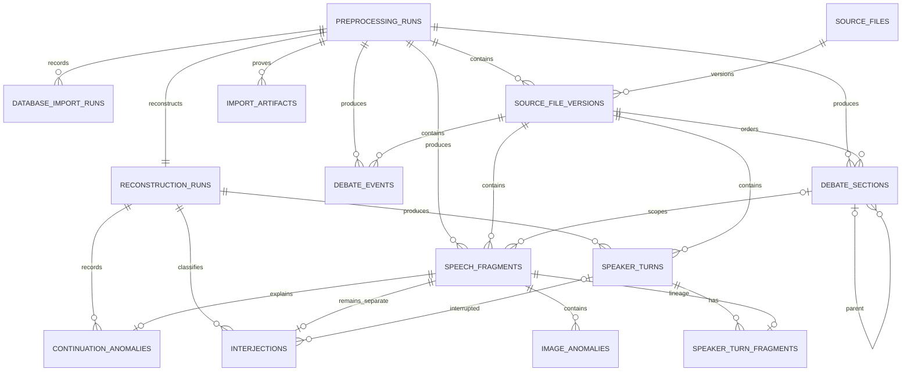

# Phase 2 PostgreSQL corpus report

Completion date: 23 July 2026  
Accepted input: `data/processed/phase1-full-20260723-v4/`  
Scope: PostgreSQL corpus foundation only

## 1. Summary and outcome

Phase 2 is complete. PostgreSQL 16.9 starts in the development environment, Alembic
revision `20260723_01` creates the corpus schema from empty, and the canonical accepted
Phase 1 run imports transactionally. Exact counts, lineage, continuation dispositions,
interjection separation, source status, artefact checksums, and anomaly counts
reconcile. An identical second import produced `completed_reused` with zero corpus
writes. Verification passed again after PostgreSQL restart.

No raw XML was read by the importer, modified, moved, or copied. No accepted Phase 1
output was modified. Phase 3 was not started.

## 2. Final database architecture

The database uses bigint `GENERATED ALWAYS AS IDENTITY` internal primary keys and
retains Phase 1 keys as immutable unique identifiers. JSON strings become validated
JSONB, warning lists become `text[]`, and unknown booleans remain null.

The importer validates the accepted path, manifest, inventory, 259 manifested files,
SHA-256 values, sizes, Parquet schemas, report set, zero-row failure reports, and exact
counts before writes. PyArrow scans one fragment and one 2,000-row batch ahead without
threads. psycopg COPY loads temporary JSONB/checksum staging; dependency-ordered SQL and
deferred compatibility triggers promote records. SQL/Python reconciliation runs before
the single corpus transaction commits. Failed attempts retain only sanitised attempt
metadata.

## 3. Tables and views

| Relation | Purpose |
|---|---|
| `preprocessing_runs` | Immutable manifest and accepted Phase 1 run identity |
| `database_import_runs` | Completed, reused, failed, and rolled-back attempts |
| `source_files` | Validated logical corpus paths |
| `source_file_versions` | Source-byte identity and processing evidence |
| `debate_sections` | Ordered major/minor headings and parents |
| `debate_events` | Divisions and bills with lossless JSONB payload |
| `speech_fragments` | All exact Phase 1 fragments |
| `reconstruction_runs` | Turn-reconstruction version/config identity |
| `speaker_turns` | Reconstructed annotation units |
| `speaker_turn_fragments` | Ordered fragment lineage |
| `interjections` | Separate linked/unlinked interjections |
| `continuation_anomalies` | Retained orphan continuation evidence |
| `image_anomalies` | Four reviewed images; no retrieval |
| `import_artifacts` | Manifest/Parquet/report checksum and schema proof |

Read-only views are `annotation_ready_turns`, `turns_with_fragment_counts`, and
`corpus_year_summary`. They preserve unknowns/anomalies and add no political fields.

## 4. Migration

Revision: `20260723_01` (`Create the immutable Phase 2 corpus schema`).

The measured empty-database upgrade took **1.323 seconds**. Upgrade, repeated upgrade,
downgrade, and re-upgrade passed against PostgreSQL. The migration creates tables,
constraints, indexes, compatibility/immutability triggers, functions, and views.

## 5. Imported Phase 1 identity

- Run: `phase1-full-20260723-v4`
- Pipeline: `1.0.0`
- Manifest SHA-256:
  `1d7698829d9d1cdceb0373c5d2fc55a719f2a43e6d5242e38bd99067215680df`
- Inventory SHA-256:
  `7121a0fb10676b7bd68d582c5985671b71343ded51343b3f5f2b35bb474144e2`
- Source files/bytes: 926 / 784,583,349
- Manifested artefacts: 259 files / 1,137,990,532 bytes
- Database artefact rows: 260 (listed files plus manifest)

## 6. Exact imported counts

| Dataset | Rows |
|---|---:|
| Source file versions | 926 |
| Debate sections | 97,975 |
| Debate events | 14,352 |
| Speech fragments | 269,793 |
| Speaker turns | 160,577 |
| Turn-fragment lineage | 191,263 |
| Interjections | 78,530 |
| Continuation anomalies | 8,239 |
| Image anomalies | 4 |

## 7. Reconciliation results

Every required invariant passed with zero failures:

- all fragment, turn, lineage, and interjection run/source references are compatible;
- no interjection fragment has turn lineage;
- every fragment has exactly one Phase 1 disposition;
- merged and orphan continuations never overlap;
- stored turn fragment counts equal ordered lineage counts;
- all 926 sources are completed, reconciled, and source-URL-marker valid;
- deterministic keys are unique and artefact checksum metadata is valid;
- 77,562 interjections are linked and 968 are unlinked.

Continuation anomaly reasons remain exactly 7,050 known speaker-ID mismatch, 1,089
identity missing/ambiguous, 97 no active candidate, and 3 division boundary.

## 8. Idempotency and conflicts

The second canonical import completed as `completed_reused` in **3.598 seconds**
(3.637 seconds attempt wall interval), revalidated the accepted package and database
invariants, changed no corpus count, and reported `corpus_writes: 0`.

A real PostgreSQL test changes content while retaining a deterministic source key. The
importer identifies `source_file_versions`, raises `ImportConflictError`, overwrites
nothing, rolls back the new run, and records `rolled_back`.

Two pre-promotion development attempts exposed a tuple/dictionary result-row defect.
Both aborted before corpus rows and remain honestly recorded as rolled back. The defect
was fixed and regression-covered; the accepted and isolated performance imports passed.

## 9. Tests and constraints

Tests cover migration round-trips, expected relations/views, invalid SHA/count checks,
nullable unknowns, accepted-run immutability, fixture COPY import, reconciliation,
ordered lineage, safe queries, zero-write reuse, deferred constraint failure with total
rollback, and conflicting content. Triggers validate section parent scope,
turn/fragment compatibility, and interjection/lineage exclusion.

- pytest: **26 passed** in 8.07 seconds
- Ruff: **all checks passed**
- strict mypy: **no issues in 29 source files**
- SQLite: **not used**

## 10. Size and performance

Optimized full-load measurement:

- migration: **1.323 seconds**;
- import plus in-transaction verification: **458.862 seconds**;
- in-import verification: **3.473 seconds**;
- independent post-restart verification: **1.413 seconds**;
- peak Python resident memory: **592,920,576 bytes** (about 565.5 MiB);
- largest Arrow/COPY batch: **2,000 rows**.

Default threaded PyArrow readahead initially peaked at 2.57 GB. Single-threaded
one-batch/one-fragment readahead and Arrow pool release reduced peak memory about 77%
without changing counts/checksums. The temporary measurement database was then removed.

Accepted storage:

- database: **2,735,084,003 bytes** (about 2.55 GiB);
- user table heaps: **746,995,712 bytes**;
- user indexes: **186,990,592 bytes**;
- total user relations including TOAST: **2,726,199,296 bytes**.

Largest total relations are `speech_fragments` (1,631,469,568),
`speaker_turns` (846,577,664), `debate_sections` (84,549,632), `interjections`
(72,278,016), and `speaker_turn_fragments` (52,568,064). No partitioning or full-text
index was added.

## 11. Security and immutability

Credentials are environment-only, `.env` is ignored, Compose binds to `127.0.0.1`, and
complete URLs are not logged. Dynamic identifiers are internally allowlisted and values
are parameterised. Inspection truncates speech text by default.

Triggers reject update/delete for immutable corpus/provenance tables and changes to
accepted preprocessing/reconstruction runs. Corrections require a new version; Alembic
retains controlled schema-change ability.

## 12. Known limitations

- General coexistence policy for future accepted runs with overlapping stable keys
  remains to be designed.
- Database role separation, backups, monitoring, and production timeouts are deployment
  work.
- Turn start times and turn-level merge flags were not invented because accepted
  Parquet lacks them; lineage exposes merging.
- Section business classifications were not inferred.
- No repair, political enrichment, annotation, search, job framework, or web/API layer
  exists.

## 13. Remaining blockers before Phase 3

Owner decisions required:

1. authoritative CAP/Australian taxonomy and first annotation codebook;
2. initial users, authentication method, and role permissions;
3. coder count, assignment, disagreement, blinding, recoding, and adjudication policy;
4. project eligibility/sampling/versioning and export-selection rules;
5. whether separate owner/migration/importer/application database roles begin in
   development or deployment;
6. retention/audit requirements for authentication and annotation events.

Deployment, political metadata, LLM provider policy, and Telegram/Hermes contracts
remain blockers for their later phases, not Phase 2.

## 14. Phase boundary confirmations

Raw XML is unchanged and ignored by Git. The accepted Phase 1 directory is unchanged
and ignored; all 259 listed checksums still match. Phase 3 was not started. No users,
authentication tables, annotation projects/tasks/labels, web routes/dashboard,
political metadata, LLM jobs, Telegram/Hermes code, Redis, or production deployment
configuration was created.
